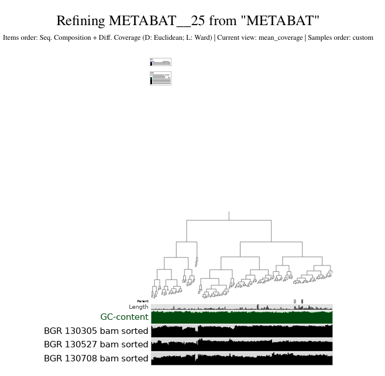
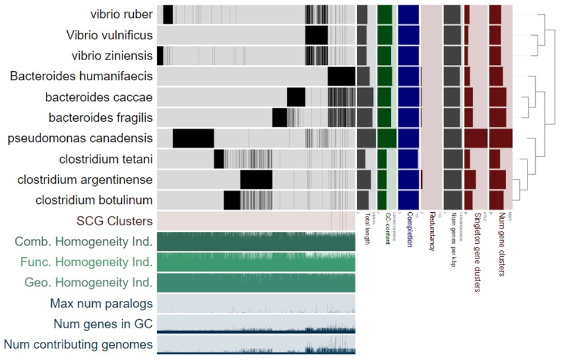

# Protocol biol217 (Marine) Microbial Omics - Peer Krause

## Day 1 Practise Session

#### All Questions during the Course are collected and answered at the end of this Protocol. 

#### What we have learned so far? 

1. Basic Linux 

2. Bioinformatics basic understanding 

3. Linux commands 

- copy from one folder to another: 

Block of code: 

```sh

cp source destination 

```

Inline code: 
This is the command `cp`

The following shows Sunam, Clusteradress for Sunam233 and given passwort, Github folder with instructions (all needed trough out the course):

```
ssh -X sunam233@caucluster.rz.uni-kiel.de 

biol217_2024!! 

https://github.com/AammarTufail/Biol217-2024.git 
```
``

## Day 2 From raw reads to MAGs

### Preperation 

Log into caucluster with Sunam233 account: 

```sh

ssh -X sunam233@caucluster.rz.uni-kiel.de 

```

Go to "Work" directory  

```sh  

cd $WORK 

``` 
All needed packages and programs are allready installed into conda environment.  

To activate this environment use the following commands: 

```sh

module load gcc12-env/12.1.0 
module load miniconda3/4.12.0 
conda activate anvio-8 

``` 

BATCH script is needed:

Prepare script: create a text document 

```sh

touch anvio_slurm 

``` 

### Quality Control of raw reads
To open text document and create a BATCH skript use: 

```sh 

emacs anvio_slurm 

``` 

Determine following parameters in the script: 

| Parameter | Explanation |
| --- | --- | 
| #SBATCH | Slurm batch script directive | 
| --partition=<name> or -p <name> | Slurm partition (~batch class) | 
| --job-name=<name> or -J <jobname> | Job name | 
| --output=<filename> or -o <filename> | Stdout file | 
| --error=<filename> or -e <filename> | Stderr file; if not specified, stderr is redirected to stdout file | 
| --nodes=<nnodes> or -N <nnodes> | Number of nodes | 
| --ntasks-per-node=<ntasks> | Number of tasks per node; number of MPI processes per node | 
| --cpus-per-task=<ncpus> or -c <ncpus> | Number of cores per task or process | 
| --mem=<size[units]> | Real memory required per node; default unit is megabytes (M); use G for gigabytes | 
| --time=<time> or -t <time> | Walltime in the format "hours:minutes:seconds" | 

 

A directory must also be defined: 

```sh

cd /work_beegfs//sunam233/Metagenomics/0_raw_reads 

fastqc 

``` 

To loop over the files with the given ending (.gz), the loop will only use the files in the given direction and will put the output in the given outputfolder
Use: 
``` 

for i in *fastq.gz; do fastqc $i -o ../1_fastqc/$i; done 

``` 

#### Finished Anvio_slurm BATCH script 

The script should then be structured as follows and contain the following information: 

```sh 

#!/bin/bash 

#SBATCH --nodes=1 

#SBATCH --cpus-per-task=4 

#SBATCH --mem=10G 

#SBATCH --time=5:00:00 

#SBATCH --job-name=fastqc 

#SBATCH --output=fastqc.out 

#SBATCH --error=fastqc.err 

#SBATCH --partiotional=base 

#SBATCH --reservation=biol217 


module load gcc12-env/12.1.0 

module load miniconda3/4.12.0 

conda activate anvio-8 


cd /work_beegfs//sunam233/Metagenomics/0_raw_reads 

fastqc 
 

for i in *fastq.gz; do echo fastqc $i -o ../1_fastqc/$i; done 

``` 

The BATCH script can then be runned, which is done with the following command: 

```sh

sbatch anvio_slurm 

``` 

The execution might take some time. To check if its still running use: 

```sh

squeue -u sunam233 

``` 

 

This shows the Job that is running on the cluster for the given account. 

If the script runs succesfully there should be new files with the provided Names in the script. (#SBATCH --xxx) 

To check for errors within the script, open the error file from the anvio_slurm file. (File might be in different direction, depending on given directory in script) 

```sh

emacs anvio_slurm.err 

``` 

If there are no errors proceed. 

#### Quality control 

First to evaluate the quality of the sequenced data fastqc and fastp are used. 

FastQC provides an overview of basic quality control metrics like the phred quality score. This metric gives an idea on how accurately the base reading was. 

With the following commands the files can be translated into .html files 

#### fastp 

fastp allows you to process the reads using different parameters. 

The following command executes a loop over the data. With the help of fastp.    

Since there are separate end readings (e.g. -i,-o), different inputs must be specified for the files R1 and R2. 


##### Define the following folders for the command (e.g. `-o` output folder) 


fastp -i ? -I ? -R ? -o ? -O ? -t 6 -q 20 

use the following explenation help:  

 

> `--html` creates an .html report file in html format\ 

>`-i` R1 input file \ 

>`-I` R2 input file name\ 

>`-R` report title, here ‘_report’ is added to each file\ 

>`-o` output_folder/R1.fastq.gz output file\ 

>`-O` output_folder/R2.fastq.gz output file\ 

>`-t` trim tail 1, default is 0, here 6 bases are trimmed\ 

>`-q` 20 reads with a phred score of <=20 are trimmed 


For the command the rawdata names are used: 
 

raw read data name: 

BGR_130305_mapped_R1.fastq.gz > -i 

BGR_130305_mapped_R2.fastq.gz > -I  

BGR_130527_mapped_R1.fastq.gz > -i 

BGR_130527_mapped_R2.fastq.gz > -I 

 

BGR_130708_mapped_R1.fastq.gz > -i 

BGR_130708_mapped_R2.fastq.gz > -I 

 

```sh 

fastp -i sample1_R1.fastq.gz -I sample1_R2.fastq.gz -R fastp_report -o sample1_R1_clean.fastq.gz -O sample1_R2_clean.fastq.gz -t 6 -q 20  

``` 
Each Sample needs its ownCode: 

Sample1 

```sh

fastp -i BGR_130305_mapped_R1.fastq.gz -I BGR_130305_mapped_R2.fastq.gz -R fastp_report -o ../2_fastp/BGR_130305_mapped_clean_R1.fastq.gz -O ../2_fastp/BGR_130305_mapped_clean_R2.fastq.gz -t 6 -q 20 

``` 
Sample2 

```sh

fastp -i BGR_130527_mapped_R1.fastq.gz -I BGR_130527_mapped_R2.fastq.gz -R fastp_report -o ../2_fastp/BGR_130527_mapped_clean_R1.fastq.gz -O ../2_fastp/BGR_130527_mapped_clean_R2.fastq.gz -t 6 -q 20 

``` 

Sample3 

```sh

fastp -i BGR_130708_mapped_R1.fastq.gz -I BGR_130708_mapped_R2.fastq.gz -R fastp_report -o ../2_fastp/BGR_130708_mapped_clean_R1.fastq.gz -O ../2_fastp/BGR_130708_mapped_clean_R2.fastq.gz -t 6 -q 20 

``` 

Clean data moved to folder: 2_fast due to the given directory in the commands. 

There is also a way to design the command as a loop (not done in the course). The command is as follows: 

 

```sh

for i in `ls *_R1.fastq.gz`; 

do 

 second=`echo ${i} | sed 's/_R1/_R2/g'` 

fastp -i ${i} -I ${second} -R "${i}"_report -o output_folder/"${i}" -O output_folder/"${second}" -t 6 -q 20 

 

done 

``` 

 

### Copy and open on computer 

To view the graphics a graphics tool like Chrome or Firefox is needed. These are located on the desktop. Therefore the .html files are copied to the harddrive. 

```sh

scp sunam233@caucluster.rz.uni-kiel.de:/work_beegfs/sunam233/Metagenomics/1_fastqc/*.html . 

``` 

### Assembly 

#### Megahit 

The data processed with fastp can now be used for genome assembly. For this purpose megahit is used. An ultrafast, memory-efficient NGS assembler. 

This allows the metagenomes to be assembled and the samples to be optimized 

##### Define the following paths for the command (e.g. `-1` path to R1 file) 

 

```sh

megahit -1 ? -1 ? -1 ? -2 ? -2 ? -2 ? --min-contig-len 1000 --presets meta-large -m 0.85 -o ? -t 12         

``` 

The full command: 
```sh

megahit -1 sample1_R1_clean.fastq.gz -1 sample2_R1_clean.fastq.gz -1 sample3_R1_clean.fastq.gz -2 sample1_R2_clean.fastq.gz -2 sample2_R2_clean.fastq.gz -2 sample3_R2_clean.fastq.gz --min-contig-len 1000 --presets meta-large -m 0.85 -o /PATH/TO/3_coassembly/ -t 12    

``` 

 

For the paths of the read data for the three probes the folder (?) names are used: 

 

BGR_130305_mapped_clean_R1.fastq.gz  

BGR_130305_mapped_clean_R2.fastq.gz  

 

BGR_130527_mapped_clean_R1.fastq.gz 

BGR_130527_mapped_clean_R2.fastq.gz 

 

BGR_130708_mapped_clean_R1.fastq.gz 

BGR_130708_mapped_cleap
The finished command is shown in the following: 

 

``` 

megahit -1 BGR_130305_mapped_clean_R1.fastq.gz  -1 BGR_130527_mapped_clean_R1.fastq.gz -1 BGR_130708_mapped_clean_R1.fastq.gz -2 BGR_130305_mapped_clean_R2.fastq.gz -2 BGR_130527_mapped_clean_R2.fastq.gz -2 BGR_130708_mapped_clean_R2.fastq.gz --min-contig-len 1000 --presets meta-large -m 0.85 -o ../3_coassembly/ -t 12  

``` 

The finnished Data are located in the given output within the command. The output is: 

``` sh
-o .../3_coassembly/  

```

#### Megahit SBATCH script 

For clarity and so that the files of the previous scripts are not overwritten by BATCH, the SBATCH names must be adapted. 

```sh 

#!/bin/bash 

#SBATCH --nodes=1 

#SBATCH --cpus-per-task=4 

#SBATCH --mem=10G 

#SBATCH --time=5:00:00 

#SBATCH --job-name=megahit 

#SBATCH --output=megahit.out 

#SBATCH --error=megahit.err 

#SBATCH --partiotional=base 

#SBATCH --reservation=biol217 

``` 

The previous commands that are no longer to be executed must be marked with a #. A new path is also specified. 

```sh

cd ../xxx 

``` 

Lastly the megahit command is put in the script: 

```sh

megahit -1 BGR_130305_mapped_clean_R1.fastq.gz  -1 BGR_130527_mapped_clean_R1.fastq.gz -1 BGR_130708_mapped_clean_R1.fastq.gz -2 BGR_130305_mapped_clean_R2.fastq.gz -2 BGR_130527_mapped_clean_R2.fastq.gz -2 BGR_130708_mapped_clean_R2.fastq.gz --min-contig-len 1000 --presets meta-large -m 0.85 -o ../3_coassembly/ -t 12  

``` 

the script can then be submitted with 

```sh 

emacs anvio_slurm 

``` 

The processing will take some time. If there are no errors keep the megahit running. 


## Day 3 Assembly visualization

The final contigs can be found in the direction /3_coassemmbly

Go to the folder, if there are `final.contigs.fa` file the assembly worked.

Use `head` or `tail` to look at the start or end of the nukleotide contigs.

```sh
head final.contigs.fa
```

Use the following command to see how many contigs there are:

```sh
grep -c ">" final.contigs.fa
```
`>` Is written before each contig in the fa files. So the number of > is counted to determine the number of contigs.

There are 55836 contigs

To visualize the graph Bandage is used. Therefore it must be installed

First the fasta files need to be convertet.

```sh
megahit_toolkit contig2fastg 99 final.contigs.fa > final.contigs.fastg
```

The fasta file is now a FASTG file: k99.fastg, which can be loaded into Bandage.


### Quality Assessment of Assemblies


```sh
metaquast -t 6 -o /PATH/TO/3_metaquast -m 1000 final.contigs.fa
```

the output is put in the code, where the file is. also the file name for the assembled contigs is put in.

```sh
metaquast -t 6 -o .../3_metaquast -m 1000 final.contigs.fa
```

Add to the BATCH script: 

Change the headdings!

```sh
cd /work_beegfs/sunam233/Metagenomics/3_coassembly
```

```sh
metaquast -t 6 -o ../3_metaquast -m 1000 final.contigs.f
```

After running the BATCH script with `sbatch`

The files can be found in the output folder `3_metaquast`

If there is something in this folder and no error notes in the Anvio.slurm.err continue.

#### Looking at the report

Next step is to copy the report.pdf from the 3_metaquast to the computer harddrive.

use the following command to copy:

```sh
scp sunam233@caucluster.rz.uni-kiel.de:/work_beegfs/sunam233/Metagenomics/3_metaquast/*.pdf .
```

Looking at our pdf file `report.pdf` we can answer the following questions:


### Genome Binning reformating (First step for binning)

New folder for binning in the Metagenomics folder

```sh
mkdir 3_binning_out
```
Use following helps to create the command for the first binning procces:

```sh
anvi-script-reformat-fasta ? -o ? --min-len 1000 --simplify-names --report-file name_conversion.txt
```

```sh
anvi-script-reformat-fasta final.contigs.fa -o /PATH/TO/YOUR/contigs.anvio.fa --min-len 1000 --simplify-names --report-file name_conversion.txt
```

Final Code for genome binning can be put in BATCH script:


```sh
anvi-script-reformat-fasta final.contigs.fa -o ../3_binning_out/contigs.anvio.fa --min-len 1000 --simplify-names --report-file binning_conversion.txt
```

### Mapping

Then the raw reads need to be mapped onto the assembled contigs. Mapping will be done using bowtie2. Use the following command to index your mapping reference fasta file. Needed for the next steps and basically makes mapping faster.

The next command is to index the mapping reference fasta file:

Run it three times cause of three raw samples

```sh
module load bowtie2
bowtie2-build contigs.anvio.fa contigs.anvio.fa.index
```

Now bowtie2 can be used for the actual mapping. The loop command, below have the single command for better understanding:

```sh
module load bowtie2
bowtie2 --very-fast -x contigs.anvio.fa.index -1 ? -2 ? -S ?
```

This command has do be done wiht the raw reads, therefore we use it three times for the three raw read files:


```sh
module load bowtie2
bowtie2 --very-fast -x contigs.anvio.fa.index -1 ../2_fastp/BGR_130305_mapped_clean_R1.fastq.gz -2 ../BGR_130305_mapped_clean_R2.fastq.gz -S SAMPLE.sam
```

```sh
module load bowtie2
bowtie2 --very-fast -x contigs.anvio.fa.index -1 ../2_fastp/BGR_130527_mapped_clean_R1.fastq.gz -2 ../BGR_130527_mapped_clean_R2.fastq.gz -S SAMPLE.sam
```

```sh
module load bowtie2
bowtie2 --very-fast -x contigs.anvio.fa.index -1 ../2_fastp/BBGR_130708_mapped_clean_R1.fastq.gz -2 ../BGR_130708_mapped_clean_R2.fastq.gz -S SAMPLE.sam
```

sbatch script for mapping:


```sh
cd /work_beegfs/sunam233/Metagenomics/3_binning_out

module load bowtie2
bowtie2-build contigs.anvio.fa contigs.anvio.fa.index

bowtie2 --very-fast -x contigs.anvio.fa.index -1 ../2_fastp/BGR_130305_mapped_clean_R1.fastq.gz -2 ../2_fastp/BGR_130305_mapped_clean_R2.fastq.gz -S BGR_130305.sam

bowtie2 --very-fast -x contigs.anvio.fa.index -1 ../2_fastp/BGR_130527_mapped_clean_R1.fastq.gz -2 ../2_fastp/BGR_130527_mapped_clean_R2.fastq.gz -S BGR_130527.sam

bowtie2 --very-fast -x contigs.anvio.fa.index -1 ../2_fastp/BGR_130708_mapped_clean_R1.fastq.gz -2 ../2_fastp/BGR_130708_mapped_clean_R2.fastq.gz -S BGR_130708.sam
```

Following command is the actual loop command:

```sh
module load bowtie2
cd /PATH/TO/FASTP
for i in `ls *_R1.fastq.gz`;
do
    second=`echo ${i} | sed 's/_R1/_R2/g'`
bowtie2 --very-fast -x /PATH/TO/index -1 ${i} -2 ${second} -S /PATH/TO/4_mapping/"$i".sam 
done

```

#### Samtools

The output will be a sequence mapping file (SAM) with the .sam extension and which we convert to binary alignment and map (BAM) file with the .bam extension using samtools with the following loop

To view the mapped files use:
fill in the File names

```sh
module load samtools (only neccesarry one time)
samtools view -bS sam_file.sam > bam_file.bam
```

Do it three times for the BGR Probes:

```sh
samtools view -bS BGR_130305.sam > BGR_130305.bam
```

```sh
samtools view -bS BGR_130527.sam > BGR_130527.bam
```

```sh
samtools view -bS BGR_130708.sam > BGR_130708.bam
```

Full SBATCH script for samtools:

```sh
cd /work_beegfs/sunam233/Metagenomics/3_binning_out

module load samtools

samtools view -bS BGR_130305.sam > BGR_130305.bam

samtools view -bS BGR_130527.sam > BGR_130527.bam

samtools view -bS BGR_130708.sam > BGR_130708.bam
```

### Contigs data preparation!

You need to convqqase is an anvi’o contigs-db database that contains key information associated with your sequences.

anvi-gen-contigs-database -f contigs.anvio.fa -o contigs.db -n 'biol217'

Output anpassen und directory sowie BATCH Titel ändern.

```sh
cd /work_beegfs/sunam233/Metagenomics/3_binning_out
```

```sh
anvi-gen-contigs-database -f contigs.anvio.fa -o ../5_anvio_profiles/contigs.db -n 'biol217'
```

Change script!

Then you need to perform an HMM search on your contigs. "Basically, in anvi’o, Hidden Markov Models (or HMMs for short) are used to search for specific genes with known functions in a larger dataset"

```sh
anvi-run-hmms -c contigs.db
```
memory:  24 G 
--num-threads 4


Batch skript for anvirun:

`cd /work_beegfs/sunam233/Metagenomics/5_anvio_profiles`

anvi-run-hmms -c contigs.db --num-threads 4


### srun

Put following command in the Terminal and execute:

```sh
srun --reservation=biol217 --pty --mem=10G --nodes=1 --tasks-per-node=1 --cpus-per-task=1 --nodelist=node002 /bin/bash
```

The workspace was changed to node105 (normally all work on clusters, but miniclusters are created on which the data prep continues to run)

Then load the following modules:

```sh
module load gcc12-env/12.1.0
module load miniconda3/4.12.0
conda activate anvio-8

anvi-display-contigs-stats contigs.db
 ```

In a new Terminal log into the follwoilng local host:

```sh
ssh -L 8060:localhost:8080 sunam233@caucluster.rz.uni-kiel.de
```
After that log in with given number = n100

```sh
ssh -L 8080:localhost:8080 n100
```

Open the following link on google chrome (or else)

```
http://127.0.0.1:8060 or

http://127.0.0.1:8080
```
Presented are the finnished xxx???

Safe as .pdf with `strg + p`


## Day 4

Anvi-profile was also executed on day 3, but was faulty.

### Binning with ANVI´O

#### Anviprofile
From here on you will be using ANVI´O, an Analysis and Visualization platform for microbial ´Omics.

Together with a very extensive program, anvi’o offers a lot of explanations on every command or data type it uses, so, whenever you need more information than provided here, look through the online tutorial Anvi'o User Tutorial for Metagenomic Workflow!

anvi’o does this by using samtools in the background, it merges two separate samtools commands (sorting and indexing = fo each .bam file you have, there also is a .bam.bai file in the same directory) into one.

The first step will be to sort and index your .bam files.
For this use the following command:

Change the parameters and create the finnished command:

```sh
for i in *.bam; do anvi-init-bam $i -o "$i".sorted.bam; done

anvi-profile -i ? -c ? --output-dir ?

anvi-profile -i YOUR_SORTED.bam -c contigs.db --output-dir OUTPUT_DIR
```

Do it three times for the BGR .bam files that are the 3_binning_out (with `Cd` Path angeben). Each File needs a seperate folder, which are created manually by Anvio.


Did not work because of the following command:
```sh
for i in *.bam; do anvi-init-bam $i -o "$i".sorted.bam; done
```

The files were put back into the `3_binning_out` folder. Because of output (-0) "$i".

Many problems, final code ?: Solution: Execute each command individually directly in the terminal.

```sh
anvi-profile -i BGR_130305.bam.sorted.bam -c ../5_anvio_profiles/contigs.db --output-dir ../5_anvio_profiles/BGR_130305

anvi-profile -i BGR_130527.bam.sorted.bam -c ../5_anvio_profiles/contigs.db --output-dir ../5_anvio_profiles/BGR_130572

anvi-profile -i BGR_130708.bam.sorted.bam -c ../5_anvio_profiles/contigs.db --output-dir ../5_anvio_profiles/BGR_130708

```


#### Anvi Merge

```sh
anvi-merge /PATH/TO/SAMPLE1/? /PATH/TO/SAMPLE2/? /PATH/TO/SAMPLE3/? -o ? -c ? --enforce-hierarchical-clustering
```

Put in Input, Output, and c
Finnished command:

Use the SBATCH skript again:
```sh
anvi-merge ./5_anvio_profiles/BGR_130305/PROFILE.db ./5_anvio_profiles/BGR_130572/PROFILE.db ./5_anvio_profiles/BGR_130708/PROFILE.db -o ./6_merged_profiles -c ./5_anvio_profiles/contigs.db --enforce-hierarchical-clustering
```

#### !After that the computing is done!

### Binning

Two binners are used. Firts Metabat and then MaxBin2

#### Binning with Metabat2
Fill in the parameters:

```sh
anvi-cluster-contigs -p /PATH/TO/merged_profiles/PROFILE.db -c /PATH/TO/contigs.db -C METABAT --driver metabat2 --just-do-it --log-file log-metabat2

anvi-summarize -p /PATH/TO/merged_profiles/PROFILE.db -c /PATH/TO/contigs.db -o SUMMARY_METABAT -C METABAT ?
```

`-p` output folder from the last step/PROFILE.db file with the merged profiles
`-c` contig.db folder
`-C` name of the output collection that this step will create. Note that this will be stored within your merged profiles and not as an extra file
`--driver` here you can name the driver you want to use
`--just-do-it` you need to specify this flag as `anvi-cluster-contigs` is an experimental workflow of the anvi´o program and therefore still under development. This way the developers want to make sure you are aware of it.

Put the following commands in the SBATCH srcipt and chage the Headlines:

```sh
anvi-cluster-contigs -p ./6_merged_profiles/PROFILE.db -c ./5_anvio_profiles/contigs.db -C METABAT --driver metabat2 --just-do-it --log-file log-metabat2

anvi-summarize -p ./6_merged_profiles/PROFILE.db -c ./5_anvio_profiles/contigs.db -o SUMMARY_METABAT -C METABAT

```

#### Binning with MaxBin2

For the seccond binning just do the same steps like before but with MaxBin2:

```sh
anvi-cluster-contigs -p /PATH/TO/merged_profiles/PROFILE.db -c /PATH/TO/contigs.db -C MAXBIN2 --driver maxbin2 --just-do-it --log-file log-maxbin2

anvi-summarize -p /PATH/TO/merged_profiles/PROFILE.db -c /PATH/TO/contigs.db -o SUMMARY_MAXBIN2 -C MAXBIN2
```

```sh
anvi-cluster-contigs -p ./6_merged_profiles/PROFILE.db -c ./5_anvio_profiles/contigs.db -C MAXBIN2 --driver maxbin2 --just-do-it --log-file log-maxbin2

anvi-summarize -p ./6_merged_profiles/PROFILE.db -c ./5_anvio_profiles/contigs.db -o SUMMARY_MAXBIN2 -C MAXBIN2
```

After finishing no more srun!

### MAGs Quality Estimation

Estimate your genomes completeness and contamination levels.
You can assess the quality of your bins by using:

```sh
anvi-estimate-genome-completeness -c /PATH/TO/contigs.db -p /PATH/TO/merged_profiles/PROFILE.db -C METABAT
```
```sh
anvi-estimate-genome-completeness -c ./5_anvio_profiles/contigs.db -p ./6_merged_profiles/PROFILE.db -C METABAT
```

In the next part you will visualize and evaluate your results.
If you want to check what collections you generated you can use:

```sh
anvi-estimate-genome-completeness -p ./6_merged_profiles/PROFILE.db -c ./5_anvio_profiles/contigs.db --list-collections
```

fill in the lacking parameters:

```sh
anvi-estimate-genome-completeness -p ./6_merged_profiles/PROFILE.db -c ./5_anvio_profiles/contigs.db --list-collections
```
Use `anvi-interactive` to manually inspect the work on bins.
Therefore use the following script:

```sh

module load gcc12-env/12.1.0
module load miniconda3/4.12.0
conda activate anvio-8

anvi-interactive -p ./6_merged_profiles/PROFILE.db -c ./5_anvio_profiles/contigs.db -C METABAT

anvi-interactive -p ./6_merged_profiles/PROFILE.db -c ./5_anvio_profiles/contigs.db -C MAXBIN2
```

The Image is opened manually in a Webbrowser

Safe it as pdf and answer the following Questions:


### Bin refinement

Do this in Terminal again:

First, you can use the following command to get a list of your collections; then use anvi-summarize:

```sh
anvi-summarize -p ./6_merged_profiles/PROFILE.db -c ./5_anvio_profiles/contigs.db --list-collections
```

Then use anvi-summarize as displayed below.

```sh
anvi-summarize -c ./5_anvio_profiles/contigs.db -p ./6_merged_profiles/PROFILE.db -C METABAT -o SUMMARY_METABAT2 --just-do-it
```

Search the folder of the different bins with:

```sh
anvi-estimate-genome-completeness -c ./5_anvio_profiles/contigs.db -p ./6_merged_profiles/PROFILE.db -C METABAT
```

As each bin is stored in its own folder, use:

Do this for all Archaea bins.
```sh
cd ./SUMMARY_METABAT2/bin_by_bin`

mkdir ../../ARCHAEA_BIN_REFINEMENT

cp /METABAT__25/*.fa ../../ARCHAEA_BIN_REFINEMENT/

cp ../ARCHAEA_BIN_REFINEMENT/*.fa /PATH/TO/ARCHAEA_BIN_REFINEMENT/
```

bin for archaea:

METABAT__25 | ARCHAEA

METABAT__40 | ARCHAEA

METABAT__15 | ARCHAEA

### Day 5

#### Chimera detection in MAGs

Use GUNC to check run chimera detection. Chimeric genomes are genomes wrongly assembled out of two or more genomes coming from separate organisms.

To use GUNC , activate the following environment:

```sh
module load gcc12-env/12.1.0
module load miniconda3/4.12.0
conda activate gunc
```

Use the following loop to process all your files in one run:

```sh
cd ./Metagenomics/ARCHAEA_BIN_REFINEMENT

mkdir GUNC

for i in *.fa; do gunc run -i "$i" -r /work_beegfs/sunam233/Databases/gunc_db_progenomes2.1.dmnd --out_dir GUNC --threads 10 --detailed_output; done
```

```sh

gunc plot -d ./GUNC/diamond_output/METABAT__25-contigs.diamond.progenomes_2.1.out -g ./GUNC/genes_calls/gene_counts.json
```


The following script is for the Chimera detection:

```sh

module load gcc12-env/12.1.0
module load miniconda3/4.12.0
conda activate gunc

cd ./Metagenomics/ARCHAEA_BIN_REFINEMENT

mkdir GUNC

for i in *.fa; do gunc run -i "$i" -r /work_beegfs/sunam233/Databases/gunc_db_progenomes2.1.dmnd --out_dir GUNC --threads 10 --detailed_output; done

gunc plot -d ./GUNC/diamond_output/METABAT__25-contigs.diamond.progenomes_2.1.out -g ./GUNC/genes_calls/gene_counts.json

gunc plot -d ./GUNC/diamond_output/METABAT__40-contigs.diamond.progenomes_2.1.out -g ./GUNC/genes_calls/gene_counts.json

gunc plot -d ./GUNC/diamond_output/METABAT__15-contigs.diamond.progenomes_2.1.out -g ./GUNC/genes_calls/gene_counts.json
```

#### Manual bin refinement

As large metagenome assemblies can result in hundreds of bins, pre-select the better ones for manual refinement, e.g. > 70% completeness.

Before you start, make a copy/backup of your unrefined bins the ARCHAEA_BIN_REFINEMENT.

```sh
cp ./Metagenomics/ARCHAEA_BIN_REFINEMENT/*.fa
 (done manually) 
```

First load the following Modules:

```sh

module load gcc12-env/12.1.0
module load miniconda3/4.12.0
conda activate anvio-8

```

Use anvi refine to work on your bins manually with the following command (fill in the parameters):

```sh
anvi-refine -c /PATH/TO/contigs.db -C METABAT -p /PATH/TO/merged_profiles/PROFILE.db --bin-id Bin_METABAT__##
```

Bin_METABAT__# = METABAT__25 | ARCHAEA

METABAT__40 | ARCHAEA

METABAT__15 | ARCHAEA


Do this for all three Archaea in the console: 

```sh
anvi-refine -c ../5_anvio_profiles/contigs.db -C METABAT -p ../6_merged_profiles/PROFILE.db --bin-id METABAT__25

anvi-refine -c ../5_anvio_profiles/contigs.db -C METABAT -p ../6_merged_profiles/PROFILE.db --bin-id METABAT__40

anvi-refine -c ../5_anvio_profiles/contigs.db -C METABAT -p ../6_merged_profiles/PROFILE.db --bin-id METABAT__15
```

BATCH script for the refinement:

```sh

module load gcc12-env/12.1.0
module load miniconda3/4.12.0
conda activate anvio-8

anvi-refine -c ./5_anvio_profiles/contigs.db -C METABAT -p ./6_merged_profiles/PROFILE.db --bin-id METABAT__25
```

40 und 15 nicht für weitere studien aber man kann die taxonomy einsehen

25 zeigt gute qualität


### Coverage visualization

#### how abundant are the archaea bins in the 3 samples? (relative abundance) 
- you can also use anvi-inspect -p -c, anvi-script-get-coverage-from-bam or, anvi-profile-blitz. Please look up the help page for each of those commands and construct the appropriate command line

commands:

```sh

-p ./6_merged_profiles/PROFILE.db
-c ./5_anvio_profiles/contigs.db
```

```sh
anvi-inspect -p ./6_merged_profiles/PROFILE.db -c ./5_anvio_profiles/contigs.db --split-name 
 
anvi-script-get-coverage-from-bam

anvi-profile-blitz
```

### Taxonomic assignment


You will now add taxonomic annotations to your MAG.

Fill in the missing Parameters:

```sh
anvi-run-scg-taxonomy -c /PATH/TO/contigs.db -T 20 -P 2
```

Finnished comand:

```sh
anvi-run-scg-taxonomy -c ./5_anvio_profiles/contigs.db -T 20 -P 2
```

Now you can run anvi-estimate-scg-taxonomy, ‘This program makes quick taxonomy estimates for genomes, metagenomes, or bins stored in your contigs-db using single-copy core genes`.

To estimate abundance of Ribosomal RNAs within your dataset (coverage) use:

```sh
anvi-estimate-scg-taxonomy -c /PATH/TO/contigs.db -p /PATH/TO/profile.db --metagenome-mode --compute-scg-coverages --update-profile-db-with-taxonomy > temp.txt
```

```sh
anvi-estimate-scg-taxonomy -c ./5_anvio_profiles/contigs.db -p ./6_merged_profiles/PROFILE.db --compute-scg-coverages --update-profile-db-with-taxonomy > temp.txt
```

One final summary to get comprehensive info about your METABAT2 bins:

```sh
anvi-summarize -p /PATH/TO/merged_profiles/PROFILE.db -c /PATH/TO/contigs.db --metagenome-mode -o /PATH/TO/SUMMARY_METABAT2 -C METABAT2
```

```sh
anvi-summarize -p ./6_merged_profiles/PROFILE.db -c ./5_anvio_profiles/contigs.db --metagenome-mode -o ./SUMMARY_METABAT2 -C METABAT2
```

batch script for Taxonomic assigment:

```sh
module load gcc12-env/12.1.0
module load miniconda3/4.12.0
conda activate anvio-8module load gcc12-env/12.1.0
module load miniconda3/4.12.0
conda activate anvio-8

cd /work_beegfs/sunam233/Metagenomics

anvi-run-scg-taxonomy -c ./5_anvio_profiles/contigs.db -T 20 -P 2

anvi-estimate-scg-taxonomy -c ./5_anvio_profiles/contigs.db -p ./6_merged_profiles/PROFILE.db --compute-scg-coverages --update-profile-db-with-taxonomy > temp.txt

anvi-summarize -p ./6_merged_profiles/PROFILE.db -c ./5_anvio_profiles/contigs.db --metagenome-mode -o ./SUMMARY_METABAT2 -C METABAT2

```


## Day 6
### Genomics

The following Batch script was used for the Genomics data analysis:

Genomics script

```sh
#!/bin/bash
#SBATCH --nodes=1
#SBATCH --cpus-per-task=32
#SBATCH --mem=128G
#SBATCH --time=5:00:00
#SBATCH --job-name=01_fastqc
#SBATCH --output=01_fastqc.out
#SBATCH --error=01_fastqc.err
#SBATCH --partition=base
#SBATCH --reservation=biol217

module load gcc12-env/12.1.0
module load miniconda3/4.12.0
module load micromamba3/4.12.0
micromamba activate 01_short_reads_qc
```
Use fastqc and fastp for the short reads:

1.1 fastqc raw reads

creata new folder for output of qc and display the quality:
```sh
mkdir -p $WORK/genomics/1_short_reads_qc/1_fastqc_raw
for i in $WORK/genomics/0_raw_reads/short_reads/*.gz; do fastqc $i -o $WORK/genomics/1_short_reads_qc/1_fastqc_raw -t 32; done
```

1.2 fastp 

To proccess the Data and trimming:
```sh
mkdir -p $WORK/genomics/1_short_reads_qc/2_cleaned_reads
fastp -i $WORK/genomics/0_raw_reads/short_reads/241155E_R1.fastq.gz \
-I $WORK/genomics/0_raw_reads/short_reads/241155E_R2.fastq.gz \
-R $WORK/genomics/1_short_reads_qc/2_cleaned_reads/fastp_report \
-h $WORK/genomics/1_short_reads_qc/2_cleaned_reads/report.html \
-o $WORK/genomics/1_short_reads_qc/2_cleaned_reads/241155E_R1_clean.fastq.gz \
-O $WORK/genomics/1_short_reads_qc/2_cleaned_reads/241155E_R2_clean.fastq.gz -t 32 -q 25
```

1.3 fastqc cleaned

Displays the trimmed Data and shows the Quality after
```sh
mkdir -p $WORK/genomics/1_short_reads_qc/3_fastqc_cleaned
for i in $WORK/genomics/1_short_reads_qc/2_cleaned_reads/*.gz; do fastqc $i -o $WORK/genomics/1_short_reads_qc/3_fastqc_cleaned -t 12; done
micromamba deactivate
echo "---------short read cleaning completed successfully---------"
```

Long reads processing script:

For the long read quality Check use:
```sh
echo "---------long reads cleaning started---------"
eval "$(micromamba shell hook --shell=bash)"
micromamba activate 02_long_reads_qc
```

2.1 Nanoplot raw

Use Nanoplot for plotting the long read Data
```sh
cd $WORK/genomics/0_raw_reads/long_reads/
mkdir -p $WORK/genomics/2_long_reads_qc/1_nanoplot_raw
NanoPlot --fastq $WORK/genomics/0_raw_reads/long_reads/*.gz \
 -o $WORK/genomics/2_long_reads_qc/1_nanoplot_raw -t 32 \
 --maxlength 40000 --minlength 1000 --plots kde --format png \
 --N50 --dpi 300 --store --raw --tsv_stats --info_in_report
```

2.2 Filtlong

Used for the 
```sh
mkdir -p $WORK/genomics/2_long_reads_qc/2_cleaned_reads
filtlong --min_length 1000 --keep_percent 90 $WORK/genomics/0_raw_reads/long_reads/*.gz | gzip > $WORK/genomics/2_long_reads_qc/2_cleaned_reads/241155E_cleaned_filtlong.fastq.gz
```

2.3 Nanoplot cleaned
Now use Nanoplot again to look at the proccessed Reads:
```sh
cd $WORK/genomics/2_long_reads_qc/2_cleaned_reads
mkdir -p $WORK/genomics/2_long_reads_qc/3_nanoplot_cleaned
NanoPlot --fastq $WORK/genomics/2_long_reads_qc/2_cleaned_reads/*.gz \
 -o $WORK/genomics/2_long_reads_qc/3_nanoplot_cleaned -t 32 \
 --maxlength 40000 --minlength 1000 --plots kde --format png \
 --N50 --dpi 300 --store --raw --tsv_stats --info_in_report

micromamba deactivate
echo "---------long reads cleaning completed Successfully---------"

module purge
jobinf
```


## Day 7

First a Tutorial, then with our own Data

For the Tutorial a Panaroo Pipline was used, which can be found:

https://github.com/AammarTufail/Biol217-2024/blob/main/Tutorial_Day7a_Pangenomics.md


#### Creating our own Pangenome

For the Pangenome the following species were downloaded:

Clostridium tetani E88
Clostridium argentinense strain 89G
Clostridium botulinum A str. ATCC 3502

Bacteroides caccae CL03T12C61
Bacteroides fragilis strain FDAARGOS_1225
Bacteroides humanifaecis strain KGMB07931

Vibrio ruber strain LMG 23124
Vibrio vulnificus strain FORC_037 
Vibrio ziniensis strain ZWAL4003

Pseudomonas canadensis strain GZH03

The following Skript was used for the Pangenome creation:

```sh
#!/bin/bash
#SBATCH --nodes=1
#SBATCH --cpus-per-task=32
#SBATCH --mem=128G
#SBATCH --time=5:00:00
#SBATCH --job-name=final
#SBATCH --output=final.out
#SBATCH --error=final.err
#SBATCH --partition=base
#SBATCH --reservation=biol217

module load gcc12-env/12.1.0
module load miniconda3/4.12.0
conda activate anvio-8
```

First create new folder with:

```sh
mkdir $WORK/pangenomics/03_anvio_pangenomics
```

#### create cintigs .dbs frim .fasta

```sh
cd $WORK/pangenomics/03_anvio_pangenomics/bacterial_chromosome_data/

ls *fasta > genomes.txt
```

With the following command we remove all contigs <2500 nt:

```sh
for g in `cat genomes.txt`
do
     echo
     echo "Working on $g ..."
     echo
     anvi-script-reformat-fasta ${g}.fasta \
                               --min-len 2500 \
                                --simplify-names \
                               -o ${g}2.5K.fasta
 done

```

now we generate the contigs.db with the following loop:
```sh
for g in `cat genomes.txt`
 do
     echo
     echo "Working on $g ..."
     echo
     anvi-gen-contigs-database -f ${g}2.5K.fasta \
                               -o ${g}.db \
                               --num-threads 4 \
                               -n ${g}
 done
```
now to annotate the contigs.db use:

```sh

for g in *.db
 do
     anvi-run-hmms -c $g --num-threads 4
     anvi-run-ncbi-cogs -c $g --num-threads 4
     anvi-scan-trnas -c $g --num-threads 4
     anvi-run-scg-taxonomy -c $g --num-threads 4
 done
```

To visualize the contigs.db anvi-display is used: 
```sh
module load gcc12-env/12.1.0
module load miniconda3/4.12.0
conda activate anvio-8

anvi-display-contigs-stats $WORK/pangenomics/03_anvio_pangenomics/bacterial_chromosome_data/*db
```

With the following command will create an exyternal genome file:

```sh
anvi-script-gen-genomes-file --input-dir $WORK/pangenomics/03_anvio_pangenomics/bacterial_chromosome_data/ \
                              -o external-genomes.txt

 cd V_jascida_genomes
 anvi-estimate-genome-completeness -e external-genomes.txt

```
Now go to the right folder where the external genome file is and use the folloiwng command to investigate any contamination:

```sh
anvi-estimate-genome-completeness -e external-genomes.txt
``` 
The redundancy of clostridium is to high. Therefore refinement with the clostriudium argentinense bin is done:
For anvi interactive interface from the bin use/To Copute the pangenome the following command is used:
```sh
anvi-gen-genomes-storage -e external-genomes.txt \
                          -o My_GENOMES.db

anvi-pan-genome -g My_GENOMES.db \
                 --project-name My_Pangenome \
                 --num-threads 4                         


anvi-profile -c clostridium_argentinense.db \
              --sample-name clostridium_argentinense \
              --output-dir clostridium_argentinense \
              --blank
``` 

The following is for Triming the data:
```sh
anvi-interactive -c clostridium_argentinense.db \
                  -p clostridium_argentinense/PROFILE.db

anvi-split -p clostridium_argentinense/PROFILE.db \
            -c clostridium_argentinense.db \
            -C default \
            -o clostridium_argentinense_SPLIT

cd $WORK/pangenomics/03_anvio_pangenomics/bacterial_chromosome_data/
sed 's/clostridium_argentinense.db/clostridium_argentinense_SPLIT\/Good_contigs\/CONTIGS.db/g' external-genomes.txt > external-genomes-final.txt
                                                                    #(was changed within the course because of name error)
```

Now go to the right folder where the external genome file is and use the folloiwng command to investigate the data again if redundancy is ok:

```sh
anvi-estimate-genome-completeness -e external-genomes.txt
``` 
If contamination is good the pangenome can be computed

This is done with the following codes:

```sh
cd $WORK/pangenomics/03_anvio_pangenomics/bacterial_chromosome_data/

anvi-gen-genomes-storage -e external-genomes-final.txt \
                         -o GENOMES.db

                        
anvi-pan-genome -g GENOMES.db \
                  --project-name Pangenomes_final \
                  --num-threads 4                         
```

The following commands are now used to display the finnisehd Pangenome:
```sh

cd $WORK/pangenomics/03_anvio_pangenomics/bacterial_chromosome_data/Pangenomes_final/

anvi-display-pan -p Pangenomes_final-PAN.db -g ../GENOMES.db
```

## Day 8 and 9 Transcriptomics

First a READemption Pipeline was tested with with Data from https://www.cell.com/cell-host-microbe/fulltext/S1931-3128(13)00411-3?_returnURL=https%3A%2F%2Flinkinghub.elsevier.com%2Fretrieve%2Fpii%2FS1931312813004113%3Fshowall%3Dtrue. 

The following Pipeline was use:

```sh
#!/bin/bash
#SBATCH --nodes=1
#SBATCH --cpus-per-task=32
#SBATCH --mem=64G
#SBATCH --time=0-04:00:00
#SBATCH --job-name=reademption_tutorial
#SBATCH --output=reademption_tutorial.out
#SBATCH --error=reademption_tutorial.err
#SBATCH --partition=base
#SBATCH --reservation=biol217

module load gcc12-env/12.1.0
module load miniconda3/4.12.0

#set proxy environment to download the data and use the internet in the backend
export http_proxy=http://relay:3128
export https_proxy=http://relay:3128
export ftp_proxy=http://relay:3128

conda activate reademption
# create folders
reademption create --project_path READemption_analysis --species salmonella="Salmonella Typhimurium"

# Download the files
FTP_SOURCE=ftp://ftp.ncbi.nih.gov/genomes/archive/old_refseq/Bacteria/Salmonella_enterica_serovar_Typhimurium_SL1344_uid86645/
wget -O READemption_analysis/input/salmonella_reference_sequences/NC_016810.fa $FTP_SOURCE/NC_016810.fna
wget -O READemption_analysis/input/salmonella_reference_sequences/NC_017718.fa $FTP_SOURCE/NC_017718.fna
wget -O READemption_analysis/input/salmonella_reference_sequences/NC_017719.fa $FTP_SOURCE/NC_017719.fna
wget -O READemption_analysis/input/salmonella_reference_sequences/NC_017720.fa $FTP_SOURCE/NC_017720.fna

#rename the files similar to the genome naming
sed -i "s/>/>NC_016810.1 /" READemption_analysis/input/salmonella_reference_sequences/NC_016810.fa
sed -i "s/>/>NC_017718.1 /" READemption_analysis/input/salmonella_reference_sequences/NC_017718.fa
sed -i "s/>/>NC_017719.1 /" READemption_analysis/input/salmonella_reference_sequences/NC_017719.fa
sed -i "s/>/>NC_017720.1 /" READemption_analysis/input/salmonella_reference_sequences/NC_017720.fa
wget -P READemption_analysis/input/salmonella_annotations https://ftp.ncbi.nlm.nih.gov/genomes/all/GCF/000/210/855/GCF_000210855.2_ASM21085v2/GCF_000210855.2_ASM21085v2_genomic.gff.gz

# unzip the file
gunzip READemption_analysis/input/salmonella_annotations/GCF_000210855.2_ASM21085v2_genomic.gff.gz
wget -P READemption_analysis/input/reads http://reademptiondata.imib-zinf.net/InSPI2_R1.fa.bz2
wget -P READemption_analysis/input/reads http://reademptiondata.imib-zinf.net/InSPI2_R2.fa.bz2
wget -P READemption_analysis/input/reads http://reademptiondata.imib-zinf.net/LSP_R1.fa.bz2
wget -P READemption_analysis/input/reads http://reademptiondata.imib-zinf.net/LSP_R2.fa.bz2

#read alignment
reademption align -p 4 --poly_a_clipping --project_path READemption_analysis

# read coverage
reademption coverage -p 4 --project_path READemption_analysis

# gene quantification
reademption gene_quanti -p 4 --features CDS,tRNA,rRNA --project_path READemption_analysis
reademption deseq -l InSPI2_R1.fa.bz2,InSPI2_R2.fa.bz2,LSP_R1.fa.bz2,LSP_R2.fa.bz2 -c InSPI2,InSPI2,LSP,LSP -r 1,2,1,2 --libs_by_species salmonella=InSPI2_R1,InSPI2_R2,LSP_R1,LSP_R2 --project_path READemption_analysis

# visualzation
reademption viz_align --project_path READemption_analysis
reademption viz_gene_quanti --project_path READemption_analysis
reademption viz_deseq --project_path READemption_analysis
conda deactivate
module purge
jobinfo

```

This Pipeline was also used for Data from https://www.tandfonline.com/doi/full/10.1080/15476286.2017.1306170
The script for the new Data:

```sh
#!/bin/bash
#SBATCH --nodes=1
#SBATCH --cpus-per-task=16
#SBATCH --mem=64G
#SBATCH --time=0-05:00:00
#SBATCH --job-name=reademption_wildtype
#SBATCH --output=reademption_wildtype.out
#SBATCH --error=reademption_wildtype.err
#SBATCH --partition=base
#SBATCH --reservation=biol217

module load gcc12-env/12.1.0
module load miniconda3/4.12.0

#set proxy environment to download the data and use the internet in the backend
export http_proxy=http://relay:3128
export https_proxy=http://relay:3128
export ftp_proxy=http://relay:3128

conda activate reademption
#create folders
reademption create --project_path READemption_analysis --species methanosarcina="Methanosarcina mazei"


#Download the files (fastaq files)
grabseqs -t 4 -m metadata.csv SRR4018514 SRR4018515 SRR4018516 SRR4018517

#rename the files: 
#mutant_1
#mutant_2
#wildtype_1
#wildtype_2

#Quality Control: How to run fastqc?
module load micromamba/1.4.2
micromamba activate 01_short_reads_qc
fastqc -t 4 -o $WORK/RNAseq2/methanosarcina *.fastq.gz

mkdir ../qc_reports
for i in *.fastq.gz; do fastqc -t 4 -o ../qc_reports/fastqc_output $i; done

#look at the .html data to check the Quality

#New script for Quality contol
module load gcc12-env/12.1.0
module load miniconda3/4.12.0
module load micromamba/1.4.2
micromamba activate 01_short_reads_qc

#1.1 fastqc raw reads
mkdir -p $WORK/genomics/1_short_reads_qc/1_fastqc_raw
for i in *.gz; do fastqc $i -o $WORK/genomics/1_short_reads_qc/1_fastqc_raw -t 32; done

#1.2 fastp 
cd $WORK/RNAseq2/fastq_raw

for i in *.fastq.gz; do fastp -i $i -o ${i}_cleaned.fastq.gz -h ../qc_reports/fastqc_output${i}_fastp.html -j ${i}_fastp.json -w 4 -q 20 -z 4; done

#READemption (now use new script for Reademption)

module load gcc12-env/12.1.0
module load miniconda3/4.12.0
conda activate reademption

#read alignment
reademption align -p 4 --poly_a_clipping --project_path READemption_analysis

#read coverage
reademption coverage -p 4 --project_path READemption_analysis

#gene quantification
reademption gene_quanti -p 4 --features CDS,tRNA,rRNA --project_path READemption_analysis
reademption deseq -l wildtype_1.fastq.gz,wildtype_2.fastq.gz,mutant_1.fastq.gz,mutant_2.fastq.gz -c wildtype,wildtype,mutant,mutant -r 1,2,1,2 --libs_by_species methanosarcina=wildtype_1,wildtype_2,mutant_1,mutant_2 --project_path READemption_analysis

visualzation
reademption viz_align --project_path READemption_analysis
reademption viz_gene_quanti --project_path READemption_analysis
reademption viz_deseq --project_path READemption_analysis
conda deactivate
module purge
jobinfo

#wildtype_1.fastqc.gz,wildtype_2.fastqc.gz,mutant_2.fastqc.gz,mutant_2.fast.qc

```

5 gene that are downregulated: (mutantvs.wildtype)
1.MM_RS00150: Mt is up regulated by -2.06       yes
2.MM_RS04770: Mt is up regulated by by -1.2     yes 
3.MM_RS05370: Mt is up regulated by by -1.16    yes
4.MM_RS07870: Mt is up regulated by by -1.15    yes
5.MM_RS05335: Mt is up regulated by by -1.09    yes


5 genes that are upregulated:
1.MM_RS03790: Mt is downregulated by 1.9        yes
2.MM_RS06645: Mt is downregulated by 1.71       yes
3.MM_RS00155: Mt is downregulated by 1.58       yes
4.MM_RS02310: Mt is downregulated by 1.3        yes
5.MM_RS00765: Mt is downregulated by 1.23       yes


## The following Part contains all Questions that were asked during the Course

### Day 1

#### How to add (upload) links and images?  
Use the following command:

```sh 

```
or
```sh

```

### Day 2

#### Submitted Picture of Bandage contigs


- In this Picture the assembled contigs can be seen. The contigs are sorted by size and are displayed using Bandage.
  
### Day 3

#### What is your N50 Value? Why is this value relevant?
- N50= 3014
- The genome assembly resulted in an N50 value of 3014 base pairs. This means that half of the genome is covered by contiguous segments (contigs) of 3014 base pairs or longer.

#### How many contigs are assembled?
- 55836, viewable with `head` in the .fa files

#### What is the total length of the contigs?
- 142642586

#### Number of Archaea bins you got from MetaBAT2?
-	37 bins, 36 bacterial, 1 Achaea bin, 9 with good quality with high Completion and low redundancy, 10 blanks

#### Number of Archaea bins you got from Maxbin2?
-	49 Bins, 48 Bacterial, 1 Archaea, two good bins with high Completion and low redundancy, 20 blanks

#### Which binning strategy gives you the best quality for the Archaea bins??
-	 Metabat: Gives  less blanks. The redunancy overall is much better compared to Maxbin2, there are ore bacteria with a completion above 90% and a redundancy less than 5%.  
  
#### How many Archaea bins do you get that are of High Quality? How many bacteria bins do you get that are of High Quality? 
-  Metabat: > Archea - 0 (only one Archaea with redundancy 5,26 and completion 97,3), > Bacteria - 10
-  Maxbin: > Archea - 0 (only one Archaea with redundancy 80,26 and completion 96,05) > Bacteria - 3

### Day 4

#### Do you get Archaea bins that are chimeric?
- Yes, METABAT_14 shows chimerics on all phylogenetic levels with an CSS of 1.0, exeptc on species leven (CSS= 0.42)
  
#### In your own words (2 sentences max), explain what a chimeric bin is.
- A Chimeric bin is a bin that is contaminated with different species data. 

#### Does the quality of your Archaea improve?
There was no significant improvement of the Archaea bin Quality. This is why there is only a before Figure.



#### How abundant are the archaea bins in the 3 samples? (relative abundance)

Abundance (%)
Sample	    BGR_130305	BGR_130527	BGR_130708
METABAT_25	1.76	    1.14	    0.58
METABAT_40	0.79	    0.27	    0.40
METABAT_15	0.84	    0.01	    0.40

### Day 5

#### Did you get a species assignment to the Archaea bins previously identified?
-	METABAT_40 = Methanoculleus thermohydrogenotrophicum
-	METABAT_25 = Methanoculleus sp012797575
-	METABAT_15 = Methanosarcina flavescens

### Day 6

### How Good is the read quality?
11,4 thread score

### How many reads do you had before trimming and how many do you have now?
Short:
- Before: 1639549
- After: 1613392
Long: 
-	Before: 15963
-	After: 12446

#### Did the quality of the reads improve after trimming?
Longreads:
-	Before 10,4 
-	After 11,4
- The quality improved after trimming, because threadscore is lower

#### How good is the quality of genome?
- 89,9 completenes, 0,2 contamination
Why did we use Hybrid assembler?
- To combine short reads and long reads to get a better assembly

#### What is the difference between short and long reads?
- Shortreads: produced by Illumina, about 150 -300 bp long
- Longreads:  long read up to 10.000, üroduced by sanger

#### Did we use Single or Paired end reads? Why?
- Paired, to increase the reliability.

#### Write down about the classification of genome we have used here

d__Bacteria;p__Bacteroidota;c__Bacteroidia;o__Bacteroidales;f__Bacteroidaceae;g__Bacteroides;s__Bacteroides sp002491635

### Day 7

#### Which one of the genomes looks like the most complete and clean?
- the most clean is vibrio vulnificus with a redundancy of 0% and a Completion of 100%

#### Which of the genomes have the most similar genes with each other?
- The most similar genes can be seen in the spezies of the bacteroides as well as in the species of vibrio. There are many core genes. 

#### Explain the results of this section and add figures.

This Image shows the differnet core genes that shows if there are similar genes within the spezies. Furthermore it shows the redundancy and Completion of the Genomes.